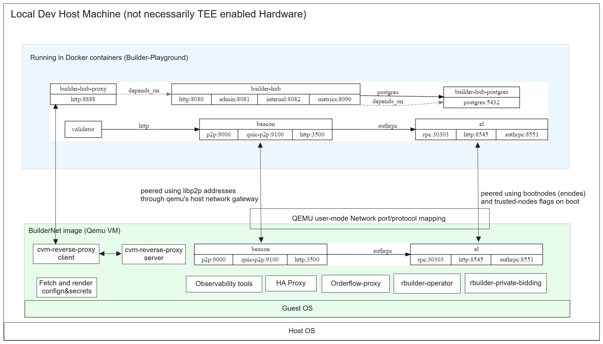

# BuilderNet Playground

## ⚠️ Pre-Alpha Proof of Concept ⚠️

This project is currently in pre-alpha stage and is being actively developed as a proof of concept. The codebase is under heavy construction and may undergo significant changes.

## Overview

BuilderNet Playground is a toolset for customizing and deploying a local dev instance of BuilderNet, this includes:

- QEMU virtual machine configuration
- Disk encryption
- Ethereum client integration (Reth and Lighthouse)
- Debugging tools
- Integration with [builder-playground](https://github.com/flashbots/builder-playground)

## Status

- This is **experimental software**
- Not ready for production use
- Features and architecture may change without notice
- Documentation is minimal and in progress

## BuilderNet Playground Setup Guide

This guide will walk you through setting up BuilderNet Playground, a local development environment for Ethereum MEV builders.

### Prerequisites

- Linux environment with Docker, QEMU, and Git installed
- Basic familiarity with command-line tools
- Go installed for building components

### Setup Process

#### 1. Clone the Repository

```bash
git clone --recursive https://github.com/yourusername/buildernet-playground.git
cd buildernet-playground
```

#### 2. Start Builder Playground Environment

```bash
# Navigate to builder-playground directory
cd builder-playground

# Build the playground executable
go build -o builder-playground

# Start the environment and generate testnet files
./builder-playground cook buildernet --output output

# Wait for all services to start
# This creates the testnet files needed for the VM
```

#### 3. Setup Builder Hub

```bash
# Clone the builder-hub repository (if not already done)
git clone https://github.com/flashbots/builder-hub.git
cd builder-hub

# Setup the development database with local configurations
make dev-db-setup

# Return to main directory
cd ..
```

#### 4. Build Lighthouse

```bash
# Build or obtain Lighthouse v7.0.0-beta.0
# This step is critical as we need to use the exact version 
# that is compatible with the playground environment

# Place the built binary in the main directory as lighthouse-bin
# This will be copied to the VM during post-provisioning
```

#### 5. Run the VM

```bash
# This single command will extract the initramfs, inject custom scripts,
# create the QEMU disk image, and run the VM
make run-gz
```

The VM will pause during boot for debugging. You should see output indicating SSH access is available at `ssh -p 10022 root@localhost`.

#### 6. Perform Post-Provisioning

In a new terminal, run:

```bash
# Transfer the required files from builder-playground to the VM
make post-provision
```

This command:
- Copies beacon node network data
- Copies genesis.json and testnet configuration
- Sets up the Lighthouse binary
- Configures proper permissions
- Continues the VM boot process

#### 7. Verify the Setup

After post-provisioning, the VM will continue booting and start the Ethereum clients. Connect to the VM to check the status:

```bash
ssh -p 10022 root@localhost

# Inside the VM, check service logs
tail -f /var/log/lighthouse.log
tail -f /var/log/reth.log
```

### System Architecture

The following diagram shows the relationship between components:



### Full Development Cycle

1. Start builder-playground services on the host
2. Setup the builder-hub database
3. Build Lighthouse v7.0.0-beta.0
4. Run the VM with `make run-gz`
5. Execute post-provisioning with `make post-provision`
6. Connect to the VM and verify Ethereum clients are running
7. Submit builder payload via the builder-hub API on port 8888

The environment is now ready for testing MEV block building and related functionality!
